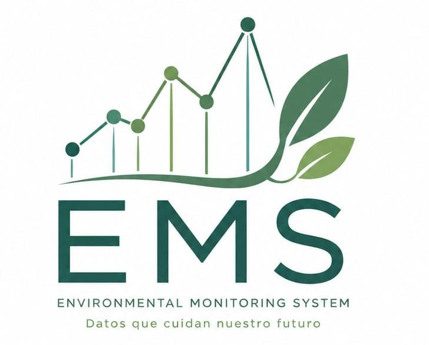

<div align="center">
  

  <h1 align="center">EMS — Sistema de Monitoreo Ambiental</h1>

  <p align="center">
    Transforma datos de cenotes en expedientes ambientales completos con inteligencia artificial.
    <br />
    <a href="https://github.com/VoltAgent/awesome-design-md"><strong>Design System →</strong></a>
    ·
    <a href="frontend/app/expediente/page.tsx"><strong>Expediente →</strong></a>
    ·
    <a href="backend/main.py"><strong>API Backend →</strong></a>
  </p>

  <br />

  
  
  
  
  
  
  
  
</div>

---

## 📋 Tabla de Contenidos

- [¿Qué es EMS?](#-qué-es-ems)
- [Arquitectura](#-arquitectura)
- [Stack Tecnológico](#-stack-tecnológico)
- [Flujo de Uso](#-flujo-de-uso)
- [Estructura del Proyecto](#-estructura-del-proyecto)
- [Instalación y Ejecución](#-instalación-y-ejecución)
- [Los 4 Formatos de Reporte](#-los-4-formatos-de-reporte)
- [Diseño y Paleta de Colores](#-diseño-y-paleta-de-colores)
- [API Backend](#-api-backend)
- [Roadmap](#-roadmap)


---

## 🌿 ¿Qué es EMS?

**EMS (Environmental Monitoring System)** es una plataforma web que permite a gestores ambientales, biólogos y autoridades convertir **mediciones de calidad de agua de cenotes** en expedientes técnicos completos usando inteligencia artificial.

### Problema que resuelve

Los datos de monitoreo de cenotes (pH, temperatura, E. coli, turbidez, etc.) suelen estar dispersos en hojas de cálculo, PDFs o JSON. No existe una forma rápida de transformar esos datos en:

- ✅ Planes de acción con responsables y costos
- ✅ Informes de cumplimiento normativo NOM-001
- ✅ Fichas informativas para visitantes
- ✅ Directorios de aliados y socios ambientales

EMS resuelve esto con un **chat de inteligencia ambiental** que normaliza los datos y, mediante **Azure AI Foundry**, genera los 4 formatos automáticamente.

---

## 🏗️ Arquitectura

```
┌─────────────────────────────────────────────────────┐
│                    Frontend (Next.js 16)              │
│  ┌──────────┐  ┌──────────┐  ┌──────────────────┐  │
│  │ Landing  │  │   Chat   │  │   Expediente     │  │
│  │  Page    │  │  /home   │  │  /expediente?id= │  │
│  └──────────┘  └────┬─────┘  └────────┬─────────┘  │
│                     │                 │             │
│              ┌──────▼─────────────────▼──────┐      │
│              │      foundry-store.ts          │      │
│              │     (localStorage dossiers)    │      │
│              └───────────────────────────────┘      │
│                      │                              │
│              ┌───────▼────────┐                     │
│              │ foundry-client │                     │
│              │    (fetch)     │                     │
│              └───────┬────────┘                     │
└──────────────────────┼──────────────────────────────┘
                       │ POST /datos-zona
                       │ { usuario_prompt, datos_zona, ui_type }
┌──────────────────────┼──────────────────────────────┐
│              ┌───────▼────────┐                     │
│              │   FastAPI       │  Backend (Python)   │
│              │  localhost:8000 │                     │
│              └───────┬────────┘                     │
│                      │                              │
│              ┌───────▼────────┐                     │
│              │  build_prompt  │                     │
│              │  (instrucción  │                     │
│              │   + esquema)   │                     │
│              └───────┬────────┘                     │
│                      │                              │
│              ┌───────▼────────┐                     │
│              │ Azure AI       │                     │
│              │ Foundry Agent  │                     │
│              │ (mymeni)       │                     │
│              └───────┬────────┘                     │
│                      │                              │
│              ┌───────▼────────┐                     │
│              │ normalize_     │                     │
│              │ output_payload │                     │
│              └────────────────┘                     │
└─────────────────────────────────────────────────────┘
```

### Flujo de datos

1. **Frontend** → El usuario describe el cenote y sube archivos en el chat CopilotKit
2. **CopilotKit** → Detecta el intent y ejecuta `registerIntake` con los datos normalizados
3. **Store** → Se crea un dossier nuevo en `localStorage` con nombre personalizado
4. **Redirección** → El usuario va a `/expediente?id=<uuid>` donde ve el dossier vacío
5. **Generación** → Al hacer clic en "Generar", `foundry-client.ts` envía un POST al backend
6. **Backend** → `build_prompt()` construye el prompt con el esquema JSON del formato solicitado
7. **Azure AI** → El agente `mymeni` en Azure AI Foundry genera el JSON estructurado
8. **Normalización** → `normalize_output_payload()` asegura campos requeridos y listas no vacías
9. **Frontend** → Recibe el JSON y lo renderiza en el componente visual correspondiente

---

## 🛠️ Stack Tecnológico

### Frontend

| Tecnología | Versión | Rol |
|---|---|---|
| **Next.js** | 16.2.6 | Framework React con App Router |
| **React** | 19.2.4 | UI declarativa con Server Components |
| **TypeScript** | 5.x | Tipado estático |
| **Tailwind CSS** | 4.x | Estilos utilitarios con `@theme` |
| **CopilotKit** | 1.57.4 | Chat IA con acciones ejecutables |
| **Lucide React** | 1.16.0 | Iconos SVG modulares ||

### Backend

| Tecnología | Versión | Rol |
|---|---|---|
| **Python** | 3.14 | Lenguaje del backend |
| **FastAPI** | 0.136.3 | Framework HTTP asíncrono |
| **Uvicorn** | 0.47.0 | Servidor ASGI |
| **Azure AI Projects** | 2.1.0 | SDK para conectar con Azure AI Foundry |
| **Azure Identity** | 1.25.3 | Autenticación con Azure |

### IA

| Servicio | Rol |
|---|---|
| **Azure AI Foundry** | Agente `mymeni` que genera los JSON de cada formato y Backend del chat CopilotKit|

---

## 📱 Flujo de Uso

```
1. Landing Page (/)
   │
   ▼
2. Chat de Inteligencia Ambiental (/home)
   │  Describe el cenote + adjunta archivos
   │  El asistente extrae y normaliza los datos
   │
   ▼
3. Nombrar el expediente (modal)
   │  Ej: "Cenote Azul - Mayo 2026"
   │
   ▼
4. Expediente (/expediente?id=xxx)
   │  ├─ Sidebar: lista de expedientes
   │  ├─ Pestañas: formatos generados
   │  └─ "Generar otro formato": Action Plan, NOM-001, Ficha, Aliados
   │
   ▼
5. Resultado visual
   ├─ Plan de Acción → Cards con nivel de urgencia (🔴🟠🟡🟢)
   ├─ Informe NOM-001 → Tabla de cumplimiento con estados
   ├─ Ficha Pública → Badge de seguridad + aspectos destacados
   └─ Directorio de Aliados → Grid con categorías por color
```

---

## 📁 Estructura del Proyecto

```
ems/
├── README.md                    # Esta documentación
│
├── backend/                     # 🐍 Backend Python
│   ├── main.py                  # FastAPI + Azure AI Foundry
│   ├── .env                     # Credenciales de Azure
│   ├── requirements.txt         # Dependencias Python
│   └── test.json                # Schema de datos de ejemplo
│
└── frontend/                    # ⚛️ Frontend Next.js
    ├── package.json
    ├── .env.local               # API keys
    ├── public/
    │   └── logo.jpeg            # Logo de la aplicación
    │
    └── app/
        ├── layout.tsx           # Root layout + CopilotKit provider
        ├── globals.css          # Paletas de colores + utilidades
        ├── page.tsx             # Landing page
        │
        ├── home/
        │   ├── page.tsx         # Chat de inteligencia ambiental
        │   │                     # (con modal para nombrar dossier)
        │
        ├── expediente/
        │   └── page.tsx         # Visualización de expedientes
        │     ├── BarraDossier   # Sidebar con lista de expedientes
        │     ├── FormatoVisual  # Dispatcher de formatos
        │     ├── PlanAccion     # Cards de urgencia
        │     ├── InformeNom     # Tabla NOM-001
        │     ├── FichaPublica   # Badge de seguridad
        │     └── DirectorioAliados  # Grid de aliados
        │
        ├── api/
        │   └── copilotkit/
        │       └── route.ts     # API Route de CopilotKit
        │
        ├── dashboard/           # Redirige a /expediente
        └── reportes/            # Redirige a /expediente
        │
    ├── components/
    │   └── ui/
    │       └── Sidebar.tsx      # Sidebar legacy
    │
    └── lib/
        ├── foundry-client.ts    # POST al backend
        ├── foundry-store.ts     # CRUD de dossiers en localStorage
        └── types/
            └── foundry.ts       # Tipos TypeScript
```

---

## 🚀 Instalación y Ejecución

### Prerrequisitos

- Node.js ≥ 20
- Python ≥ 3.12
- Azure CLI configurado (`az login`) o credenciales de Azure

### Backend

```bash
# 1. Instalar dependencias
cd backend
pip install -r requirements.txt

# 2. Configurar variables de entorno
# Editar backend/.env:
#   PROJECT_ENDPOINT=https://<tu-proyecto>.services.ai.azure.com/...
#   AGENT_NAME=<nombre-del-agente>

# 3. Iniciar servidor
python main.py
# Servidor en http://localhost:8000
```

### Frontend

```bash
# 1. Instalar dependencias
cd frontend
npm install

# 2. Configurar variables de entorno
# Editar frontend/.env.local:
#   NEXT_PUBLIC_BACKEND_URL=http://localhost:8000

# 3. Iniciar servidor de desarrollo
npm run dev
# App en http://localhost:3000

# 4. (Opcional) Build para producción
npm run build
npm start
```

---

## 📊 Los 4 Formatos de Reporte

### 1. Plan de Acción (`action_plan`)

```json
{
  "ui_type": "action_plan",
  "title": "Plan de Acción - Cenote Azul",
  "summary": "Se identificaron 3 acciones prioritarias...",
  "actions": [
    {
      "action": "Reparar sistema de drenaje",
      "urgency": "critical",    // ← define el color del card
      "owner": "Municipalidad",
      "deadline": "30/06/2026",
      "estimated_cost": "$50,000 MXN",
      "notes": "Requiere permiso de obras"
    }
  ],
  "next_steps": ["Coordinar con...", "Solicitar presupuesto"]
}
```

| Urgencia | Color | Icono |
|---|---|---|
| `critical` | 🔴 Rojo | `Skull` |
| `high` | 🟠 Naranja | `AlertTriangle` |
| `medium` | 🟡 Amarillo | `Circle` |
| `low` | 🟢 Verde | `TrendingDown` |

### 2. Informe NOM-001 (`nom001_report`)

```json
{
  "ui_type": "nom001_report",
  "parameters": [
    {
      "parameter": "pH",
      "value": "7.8",
      "limit": "6.5-8.5",
      "status": "ok"            // ← ok | exceeds | missing
    }
  ],
  "legal_conclusion": "El cenote cumple con los límites establecidos...",
  "references": ["NOM-001-SEMARNAT-2021"]
}
```

### 3. Ficha Pública (`public_fact_sheet`)

```json
{
  "ui_type": "public_fact_sheet",
  "headline": "Cenote Azul — Agua segura para visitantes",
  "highlights": ["pH dentro del rango natural", "Sin contaminación fecal"],
  "safety_label": "safe"        // ← safe | caution | restricted
}
```

### 4. Directorio de Aliados (`allies_directory`)

```json
{
  "ui_type": "allies_directory",
  "allies": [
    {
      "name": "Fundación Cenotes",
      "category": "ngo",        // ← ngo | fund | treatment | research | government | private
      "focus": "Restauración de ecosistemas",
      "region": "Quintana Roo",
      "contact": "info@fundacioncenotes.org"
    }
  ]
}
```

---

## 🎨 Diseño y Paleta de Colores

El proyecto utiliza **dos paletas de colores** definidas en [`DESIGN.md`](DESIGN.md) y configuradas en [`globals.css`](frontend/app/globals.css):

### Marketing (Landing, Home, Navegación)

```
#20352a  → dark     → Navbar, footer, headings, botones
#4e7a5a  → primary  → Acentos, badges, CTAs secundarios
#a9c7b5  → secondary → Bordes, inputs, separadores
#f6f1e8  → cream    → Fondo principal
#ffffff  → surface   → Cards, contenedores
```

### Expediente / Dossier

```
#007872  → teal-dark      → Headers, botones, sidebar activo
#419e98  → teal-primary   → Badges, íconos
#82c4be  → teal-secondary → Bordes
#b8dddc  → teal-light     → Bordes suaves
#edf6f9  → teal-surface   → Fondo del expediente
```

### Principios de diseño

| Principio | Aplicación |
|---|---|
| Sin degradados | La profundidad viene de bordes y sombras |
| Dark para estructura | Navbar, footer, sidebar en `#20352a` o `#007872` |
| Light para fondo | `#f6f1e8` (marketing) o `#edf6f9` (expediente) |
| Cards blancas con borde | Borde `secondary` o `teal-light` |
| Badges semánticos | Color + icono representativo |
| Input-only chat | Sin historial de mensajes, solo el campo de texto |

---

## 📡 API Backend

### `POST /datos-zona`

Endpoint principal que recibe los datos del cenote, los envía al agente de Azure AI Foundry y devuelve el JSON estructurado.

**Request:**
```json
{
  "usuario_prompt": "Quiero saber qué parámetros son más urgentes",
  "datos_zona": {
    "nombre_cenote": "Cenote Azul",
    "pH": 7.8,
    "temperatura_C": 29.2,
    "E_coli_NMP_100mL": null
  },
  "ui_type": "action_plan",
  "context": {},
  "previous_outputs": []
}
```

**Response:**
```json
{
  "input": { ... },
  "prompt": "Return ONLY a valid JSON object...",
  "output": {
    "ui_type": "action_plan",
    "title": "...",
    "actions": [...],
    "next_steps": [...]
  }
}
```

### `POST /datos-zona-stream`

Versión en streaming del mismo endpoint. Útil para depuración. Devuelve `text/plain` con chunks del texto generado.

---

## 🗺️ Roadmap

- [x] Landing page con hero + features + modelo
- [x] Chat de inteligencia ambiental con CopilotKit
- [x] 4 formatos de reporte visuales
- [x] Múltiples expedientes con nombre en localStorage
- [x] Paleta teal para el dossier workspace
- [x] Sistema de diseño (DESIGN.md)
- [ ] Exportar expedientes a PDF
- [ ] Autenticación de usuarios
- [ ] Sincronización con base de datos (PostgreSQL)
- [ ] Panel de dashboard con gráficos Recharts
- [ ] Mapas interactivos con Leaflet
- [ ] Expansión a otros análisis ambientales

---


<div align="center">
  <br />
  
</div>
